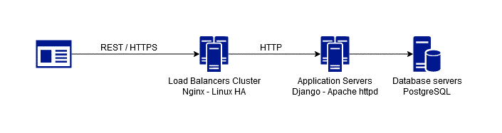
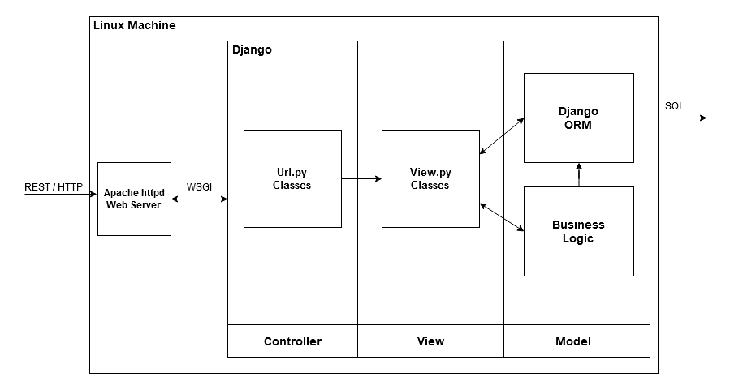
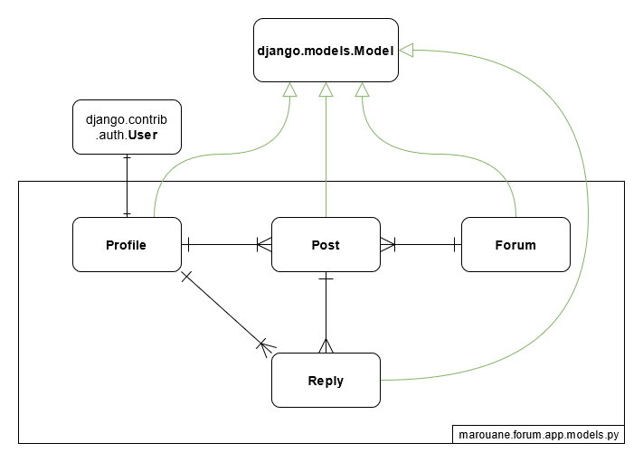
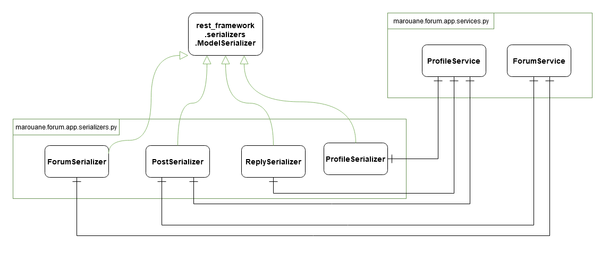
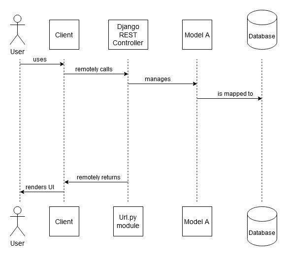
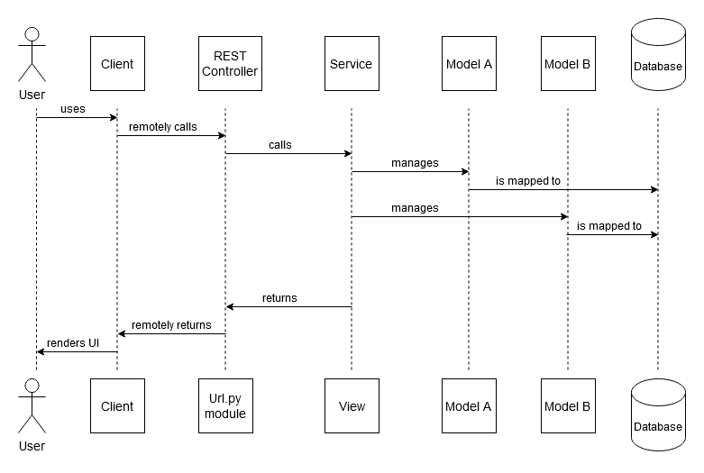

# simpleforum
The objective of this project is to design and develop a ¬¬message board/forum web application. The application allows users to register, and offers a number of forums where users can make posts and interact with other users. 
## Requirements
### Functional Requirements:
-	Roles:
    -	The application supports three roles: user, moderator, and admin.
-	User functionalities:
    -	A user can create an account.
    -	A user can create a post in any forum.
    -	A user can reply to any post.
    -	A user can consult a list of the posts and replies they have made.
    -	A user can browse forums and posts.
    -	A user can consult a user’s profile.
    -	A user can search posts by title.
    -	A user can delete their posts and replies.
    -	A user can edit their posts and replies.
-	Moderator functionalities:
    -	A moderator has all the user functionalities.
    -	A moderator can delete any post or reply.
    -	A moderator can ban a user.
- Admin functionalities:
    -	An admin has all the moderator functionalities.
    -	An admin can give a user moderator privileges.
    -	An admin can give a user admin privileges.
    -	An admin can create a new forum.
### Non-functional Requirements:
-	Access:
    - The application must fully support Chrome, Firefox and Edge browsers.
-	Performance:
    -	The application must get a score of 80 or more in the Performance metric of Google Lighthouse.
-	Scalability:
    -	The application must handle increases in load with no effect on performance and with minimal additional cost.
-	Security:
    - The application must enforce the restrictions on each of the three roles.
    -	Editing and deleting posts and replies by users must be restricted to the original author.
    -	The application must ensure high availability of its services with the use of clustering.
    -	The application must verify the authenticity of users.

## Technologies and Software
We will implement our application using Django, a powerful python web framework. Django includes a built in ORM library, and an authentication library that will allow us to fulfill the authenticity requirement. While Django includes a built-in web server, it is only meant for development. We will use Apache httpd as our web server, with which Django communicates using WSGI.
To satisfy the high availability requirement, we will place a cluster of load balancers in front of our application servers. These will be running Nginx, and coordinating with each other using Linux HA.

## Architecture
- **Physical Architecture**

  

- **Logical Architecture**

  

## Design
### Class Diagrams
- **Entity Class Diagram**

  

- **Services and Serializers Diagram**

  

### Sequence Diagrams
- **Data-driven Sequence Diagram**

  

- **Service-driven Sequence Diagram**

  

